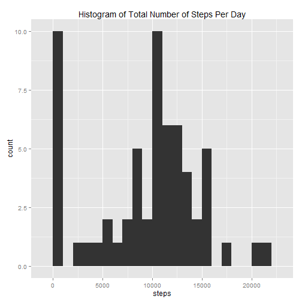
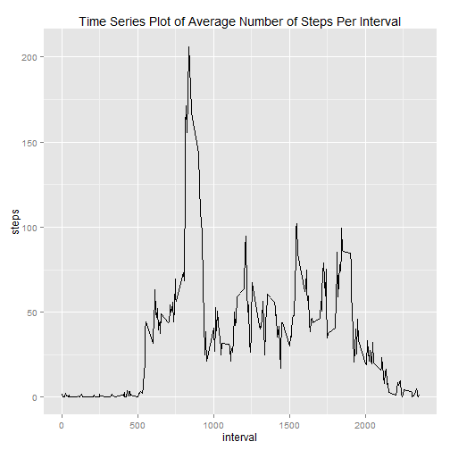
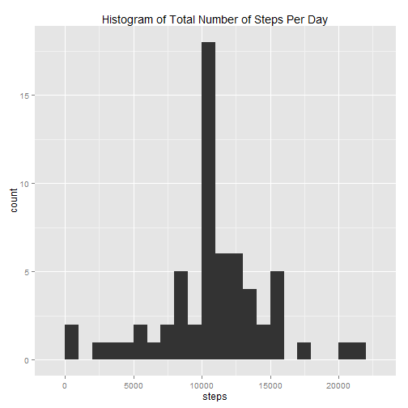
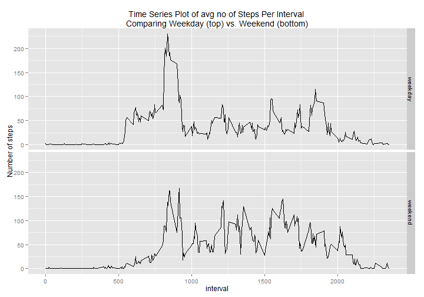

# Reproducible Research: Peer Assessment 1

## Loading and preprocessing the data

The compressed file "activity.zip" was unzipped to access the data file "activity.csv". That data file was placed in the working directory. The file was read using the following R command.


```r
# read in the CSV file
activity <- read.csv("activity.csv")
```

After examining the data, the conclusion was drawn that there is no need to do any additional preprocessing.

## What is mean total number of steps taken per day?

For this section, the missing values in the dataset are ignored.

Below is a histogram of the total number of steps taken each day, along with a calculation of the mean and median total number taken each day.


```r
# create a data frame containing the sum of steps for each date
totalStepsPerDay <- data.frame(tapply(activity$steps, activity$date, sum, 
                                      na.rm=TRUE))

# fix the variable name
names(totalStepsPerDay) <- "steps"

# create a histogram using ggplot
library(ggplot2)
ggplot(totalStepsPerDay) + aes(x=steps) + geom_histogram(binwidth=1000) + 
  labs(title="Histogram of Total Number of Steps Per Day")
```

 

```r
## Changing the 
options(scipen = 1, digits = 2)

# calculate the mean and median total steps per day
meanSteps <- round(mean(totalStepsPerDay$steps), digits=2)
medianSteps <- round(median(totalStepsPerDay$steps), digits=2)
```

The mean total number of steps per day: 9354.23  
The median total number of steps per day: 10395

## What is the average daily activity pattern?

Below is a time series plot of the average number of steps taken during each 5-minute interval (averaged across all days), along with a calculation of which interval contains the maximum number of steps.


```r
# create a data frame containing the mean number of steps for each interval
avgStepsPerInterval <- data.frame(tapply(activity$steps, activity$interval, 
                                         mean, na.rm=TRUE))

# fix the variable name
names(avgStepsPerInterval) <- "steps"

# add a new variable for the interval
avgStepsPerInterval$interval <- as.integer(row.names(avgStepsPerInterval))

# create a plot using ggplot
ggplot(avgStepsPerInterval) + aes(x=interval, y=steps) + geom_line() + 
  labs(title="Time Series Plot of Average Number of Steps Per Interval")
```

 

```r
# determine which interval contains the maximum number of steps
intervalMaxSteps <- names(which.max(avgStepsPerInterval$steps))
```

The interval with the maximum number of steps: 835

## Imputing missing values

The following code finds the number of missing values in the data set.


```r
# calculate the number of missing values
missingData <- sum(is.na(activity$steps))
```

There are 2304 missing values for "steps" in the dataset.

A new dataset (activityImp) is created; which is identical to the original dataset (activity). Except that the new dataset will have imputed values for any missing values of "steps". The imputed value is the mean for that 5-minute interval across all days.


```r
# create the new dataset
activityImp <- activity

# loop through each row in activity
for (i in 1:nrow(activity)) {
    # check if the "steps" value is missing
    if(is.na(activity$steps[i])) {
        # if so, replace the missing value with the mean for that interval
        activityImp$steps[i] <- avgStepsPerInterval$steps[
              which(avgStepsPerInterval$interval==activity$interval[i])]
    }
}
```

Using the new dataset, a histogram is constructed. The total number of steps taken each day is calcualted, along with a calculation of the mean and median of the total number taken each day.


```r
# create a data frame containing the sum of steps for each date
totalStepsPerDayImp <- data.frame(tapply(activityImp$steps, activityImp$date, 
                                         sum, na.rm=TRUE))

# fix the variable name
names(totalStepsPerDayImp) <- "steps"

# create a histogram using ggplot
ggplot(totalStepsPerDayImp) + aes(x=steps) + geom_histogram(binwidth=1000) + 
  labs(title="Histogram of Total Number of Steps Per Day")
```

 

```r
# calculate the mean and median total steps per day
meanStepsImp <- round(mean(totalStepsPerDayImp$steps), digits=2)
medianStepsImp <- round(median(totalStepsPerDayImp$steps), digits=2)
```

For the new dataset, the mean and median total number of steps per day are 10766.19 & 10766.19 respectively. This is different from the first part of the assignment. By imputing the missing data, the estimates of the number of steps have increased because values which were previously NA (and thus ignored in teh calcualtion) are now equal to the mean value. Hence, the mean and median values are slightly shifted from the previous values.

## Are there differences in activity patterns between weekdays and weekends?

In this section, the differences in activity patterns between weekdays and weekends are illustrated. The new dataset with the filled-in missing values (activityImp) is used for this section.

First, factor variable "daytype" is create which indicates whether each date is a weekday or a weekend.


```r
# wday function from lubridate package is used to determine if each date is 
# weekday or weekend
library(lubridate)
activityImp$daytype <- as.factor(ifelse(wday(activityImp$date, label=TRUE) 
                                %in% c("Sat", "Sun"), "weekend", "weekday"))
```

Next, the dataset is split by daytype. For each of the resulting datasets, the average number of steps for each interval is calculated.


```r
# split activityImp by "daytype"
s <- split(activityImp, activityImp$daytype)

# create data frames containing the mean number of steps for each interval
avgStepsWeekday <- data.frame(tapply(s$weekday$steps, s$weekday$interval, 
                                     mean))
avgStepsWeekend <- data.frame(tapply(s$weekend$steps, s$weekend$interval, 
                                     mean))

# fix the variable names
names(avgStepsWeekday) <- "steps"
names(avgStepsWeekend) <- "steps"

# add new variables for the interval
avgStepsWeekday$interval <- as.integer(row.names(avgStepsWeekday))
avgStepsWeekend$interval <- as.integer(row.names(avgStepsWeekend))

# add new variables for the daytype
avgStepsWeekday$daytype <- factor(rep("weekday", nrow(avgStepsWeekday)), 
                                  levels=c("weekday", "weekend"))
avgStepsWeekend$daytype <- factor(rep("weekend", nrow(avgStepsWeekend)), 
                                  levels=c("weekday", "weekend"))
```

Finally, the datasets are combined back together and a panel plot is created to compare the weekday and weekend datasets.


```r
# combine the weekday and weekend datasets
avgStepsCombined <- rbind(avgStepsWeekday, avgStepsWeekend)

# create a plot using ggplot
ggplot(avgStepsCombined) + aes(x=interval, y=steps) + facet_grid(daytype ~ .) +
  geom_line() + labs(title="Time Series Plot of avg no of Steps Per Interval 
Comparing Weekday (top) vs. Weekend (bottom)", y="Number of steps")
```

 

From the plot it is very clear that there are indeed differences in activity patterns between weekdays and weekends.
